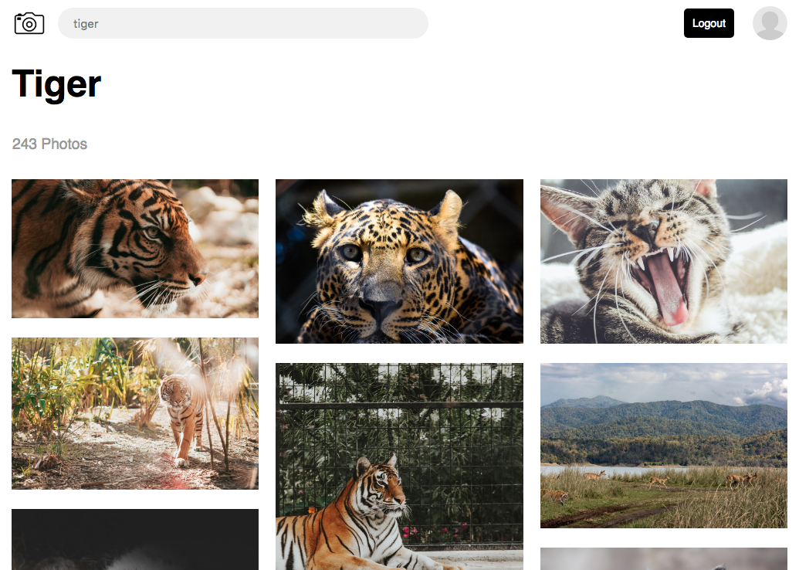

# Inspire - Unsplash clone

Web application to find inspiration through photographs.

This project was developed for the presentation of frontend group projects when performing the bootcamp in SkyLab coders.

Live demo [http://inspire-app.surge.sh](http://inspire-app.surge.sh)

## Screenshoot



## Instructions

### Running the application

Download the [app](./app) folder.

Install the dependencies

```sh
npm i
```

Run the application

```sh
npm start
```

### Running test

- Open the specs runner and execute it in the browser

````
$ open SpecRunner.html
````