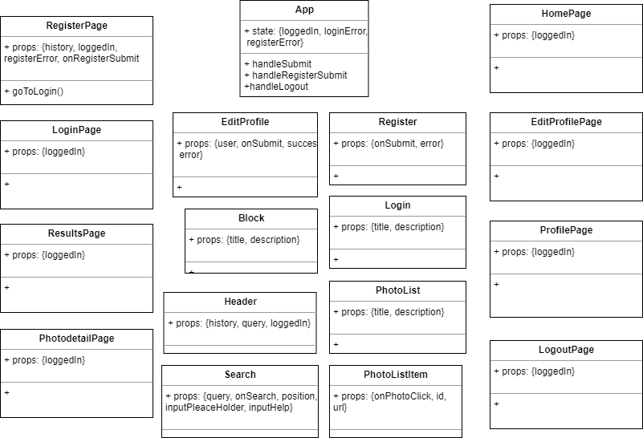

# Inspire App

## Introduction

Inspire app is a search engine for high quality photos in which users can register and create their own list of favorites.

## Functional description

### Use cases

### Activities (flows)

#### Login

#### Register

#### Search

## Technical description

### Blocks

### Components

### Sequences

### Classes

TODO completing relationship

### Data model
